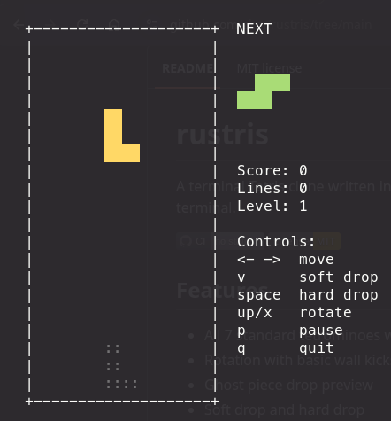

# rustris

A terminal Tetris clone written in Rust, rendered with [crossterm](https://github.com/crossterm-rs/crossterm) — no GPU or display server required, just a terminal.

[](https://github.com/zkm/rustris/actions/workflows/ci.yml)
[](LICENSE)



## Features

- All 7 standard tetrominoes with 7-bag randomization
- Rotation with basic wall kicks
- Ghost piece drop preview
- Soft drop and hard drop
- Line clearing with classic scoring (single/double/triple/tetris)
- Level progression that speeds up gravity as you clear lines
- Next-piece preview and live score/lines/level panel
- Pause

## Install

Download a prebuilt binary from the [latest release](https://github.com/zkm/rustris/releases/latest), or build from source:

```sh
git clone https://github.com/zkm/rustris.git
cd rustris
cargo build --release
./target/release/tetris
```

Or run directly without building manually:

```sh
cargo run --release
```

## Controls

| Key           | Action     |
| ------------- | ---------- |
| `←` / `→`     | Move       |
| `↓`           | Soft drop  |
| `↑` or `x`    | Rotate     |
| `Space`       | Hard drop  |
| `p`           | Pause      |
| `q` / `Esc`   | Quit       |

## Development

```sh
cargo build          # debug build
cargo test           # run tests
cargo clippy --all-targets --all-features -- -D warnings
cargo fmt --all
```

## License

Licensed under the [MIT license](LICENSE).
